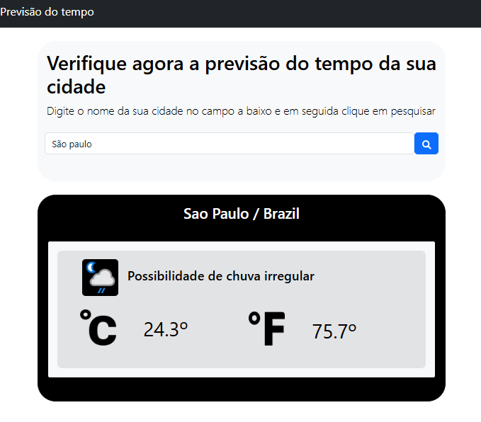

# Weather App 🌤️

Este é um projeto simples que consome uma API de previsão do tempo e mostra o clima atual em °C e °F, além das condições do tempo.

## Tecnologias utilizadas
- React
- JavaScript (ES6+)
- CSS
- Fetch API para consumir dados do clima

## Funcionalidades
- Consulta do clima por cidade
- Exibição de temperatura em Celsius e Fahrenheit
- Mostra condições do tempo (ensolarado, nublado, chuva etc.)

## Como rodar o projeto
1. Clone o repositório:
   ```bash
   git clone https://github.com/araujocg/weather-app.git

2. Entre na pasta do projeto:
   ```bash
   cd weather-app

3. Instale as dependências:
   ```bash
   npm install


4. Inicie o projeto:
   ```bash
   npm start


5. Abra http://localhost:3000
   ```bash
   no navegador para ver o app rodando.

